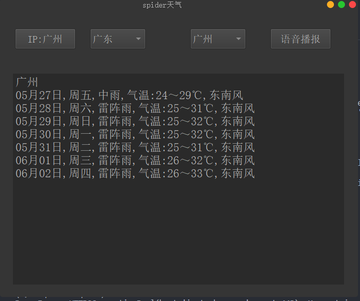

### spider 天气



#### 这个小项目是爬取[2345天气](https://tianqi.2345.com/ "2345天气")得来的天气信息，爬取通过[淘宝IP地址库](https://ip.taobao.com/)查询定位用户位置

1. 这个界面面功能一目了然了吧，就不多介绍了<br />
2. 运行文件中的<main.py>文件即可<br />
3. 如果报错，有可能是以下原因<br />
   3.1开了梯子<br />
   3.2对应库没安装<br />
4. 解决报错：<br />
   4.1关闭你的代理工具<br />
   4.2 在终端执行命令
   ```
   pip install -r lib.txt
   ```
5. 算了，估计也没谁会看，就说这么多吧，小作业记录一下

